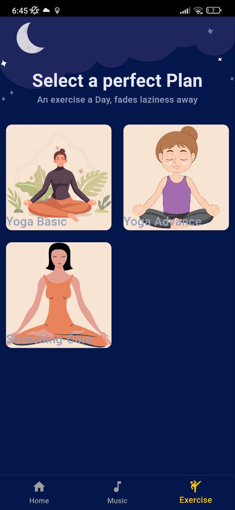
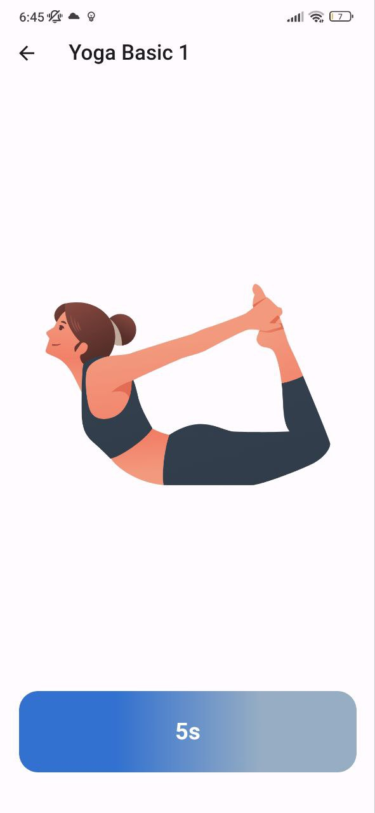

# ZenMinds - Meditation & Relaxation App 🧘‍♂️🎶

ZenMinds is a mobile application designed to help users relax, meditate, and improve their mental well-being. The app provides a variety of features including guided meditation sessions, relaxing sounds, and soothing music to help users find peace and tranquility in their busy lives.

## Features 🌟

- **Guided Meditation**: Access a library of guided meditation sessions led by experienced instructors to help you relax and focus your mind.
- **Relaxing Sounds**: Choose from a selection of calming sounds such as nature sounds, white noise, and ambient music to create a peaceful environment.
- **Sleep Aid**: Fall asleep faster with soothing sleep tracks designed to help you unwind and achieve a restful night's sleep.
- **Customizable Timer**: Set custom timers for meditation sessions or use the built-in timer for quick relaxation breaks.
- **User Profiles**: Create personalized profiles to track your meditation progress and favorite sessions.
- **Offline Access**: Enjoy uninterrupted relaxation sessions even without an internet connection.

## Installation 🛠️

To install ZenMinds on your device, follow these steps:

1. Clone this repository to your local machine.
2. Open the project in your preferred IDE (e.g., Android Studio, Xcode, VScode).
3. Connect your device and run the app on your emulator or physical device with command `flutter run`.

## Usage 🚀

1. Open the ZenMinds app on your device.
2. Explore the various navigation pages such as `music`, `exercise`.
3. Choose a session or sound that suits your mood and preferences.
4. Set a timer if desired and begin your relaxation journey.
5. Track your progress and explore new content to enhance your mental well-being.

## Screenshots 📸

| Native Splash | Audio List View | Exercise List View |
|---------|---------|---------|
|  |  |  |

| Audio Description Page | Audio Player | Exercise Player |
|---------|---------|---------|
|  |  |  |

## Support 🤝

For any questions, issues, or feedback, feel free to contact at [jamesii-b](https://github.com/jamesii-b).

## Derived from 📚
Figma-Design: [Figma Community](https://www.figma.com/community/file/882888114457713282/meditation-app-ui?searchSessionId=ls7zxt85-qmd6ktp5at&fuid=1328930692164390358)
